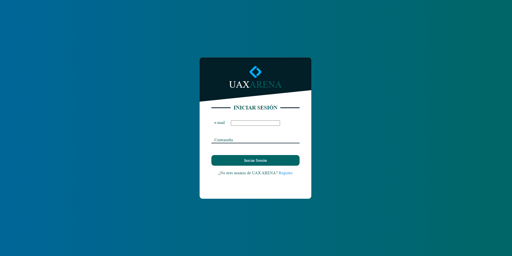

# Web promocional

Esta web consta de los siguientes páginas de información y funcionalidad:

* Login
* Registro
* Personajes
* About us
* Contacto
* Inicio

Hemos partido de un estilo muy usual en los videojuegos en el cual se muestra scrolleando o clickando en cada página el contenido de la misma.

Programado en lenguaje HTML5 y con un estilo dado en CSS

### LOGIN

El 'Login' es una página donde el usuario podrá ingresar en el juego, al igual que el registro. Más adelante se detallarán estas páginas junto a cómo funcionan relacionándolas con las BBDD.

<figure><figcaption></figcaption></figure>

### REGISTRO

De la misma forma que nuestro 'Login', este funciona para dar soporte y permitir a nuestros usuarios registrarse en nuestra BBDD para permitirles guardar su usuario y jugar a nuestro juego.

### INTRODUCCIÓN

Nos introduce en el juego y nos invita a una experiencia única de juego en las batallas que nos encontraremos.

### PERSONAJES

Se introducen los protagonistas de nuestras batallas que acompañará a nuestro usuario. Estos te harán tener mayor inmersión en el juego.

### ABOUT US

Concreta brevemente como es la familia de UAX-ARENA y nos invita a tener un contacto más cercano con nuestros colaboradores del juego.&#x20;

### CONTACTO

Es una ayuda que ofrecemos a nuestros usuarios que nos visiten en la web, dónde puede contactar con nosotros rellenado nuestra caja de e-mail y mensaje.

### INICIO

Aquí tendremos un enlace al inicio del juego en el cuál podremos empezar nuestras batallas.

